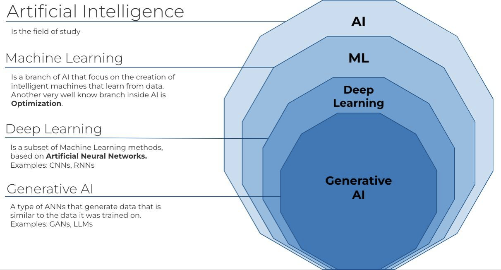
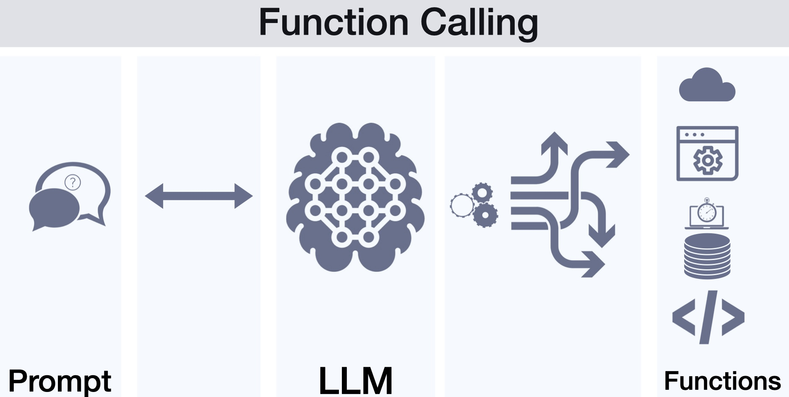
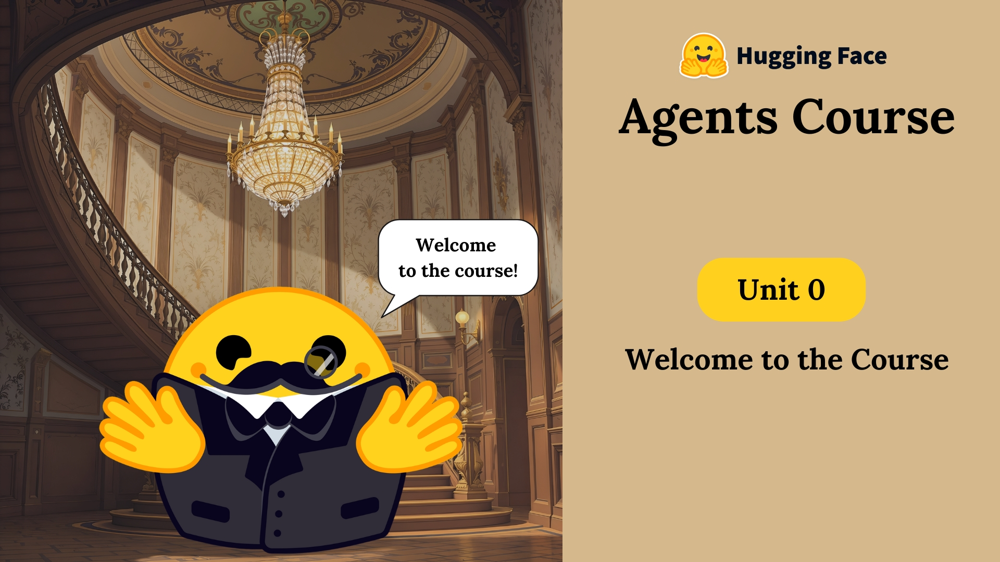

# IA na Prática: Crie Agentes Inteligentes com Python e Java!

Vamos ver código e rapidamente falar sobre agentes.

---

## O mundo da inteligência Artificial

Inteligência Artificial é sobre máquinas que fazem tarefas que normalmente exigem a inteligência de um humano. Temos diversos campos dentro da IA e entre eles temos **Machine Learning (ML)**

---
## Large Language Models

Modelos gigantes de linguagem são redes neurais baseadas em [Transformers](https://arxiv.org/abs/1706.03762) treinadas com bilhões de dados da internet. Há diversos modelos, mas no geral todos seguem esse processo de treinamento:

* O modelo de base é treinado com dados scrapeados da internet. O texto passa por um processo de tokenização usando [Tokenizers](https://huggingface.co/docs/transformers/en/main_classes/tokenizer)
* Uma segunda fase desse processo treina o LLM com **tokens especiais** e assim ela aprende a ser um assistente
* Há outras fases para reforçar o aprendizado. Tudo isso é explicado a fundo no vídeo do [Andrej Karpathy](https://www.youtube.com/watch?v=7xTGNNLPyMI)

---

### Chamando Funções

Uma dos tokens especiais ajudam a LLM a gerar conteúdo que podem ser usados para chamar código que você criou (Tools) ! Mas para isso funcionar você precisa de algum framework ou API que lê esses tokens e chama seu código

---

### Agentes

Agentes são aplicação de IA que têm **agência** do seu ambiente, ou seja, pode ser mais do que um assistente em texto. Agentes fazem uso de Tools, [MCP (Model Context Provider)](https://modelcontextprotocol.io/introduction) ou outra forma.

Sugestão: [Agents Course](https://huggingface.co/learn/agents-course/en/unit0/introduction)

---

### Frameworks e ferramentas

É possível criar ou usar agentes em Java ou Python

* Python: Smolagents, Lang Chain, (muitos) outros...
* Java: Langchain4J, Quarkus e Spring AI

---

### Demo

* Quarkus e Java interpretando Python
* Agente browser_use do Python
---

## Obrigado
